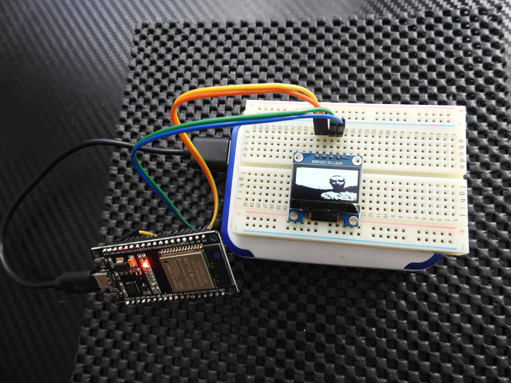
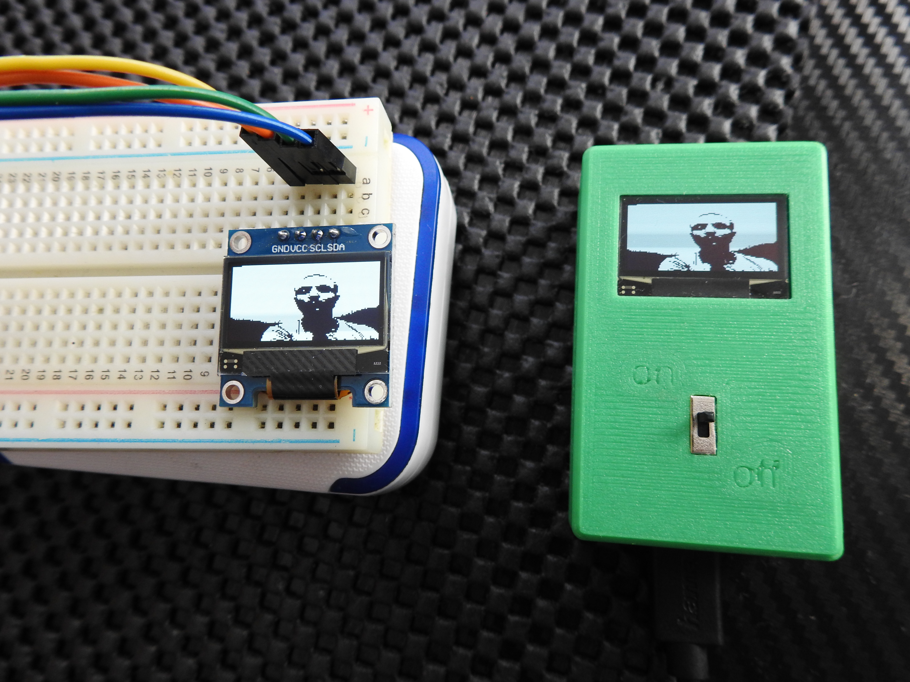
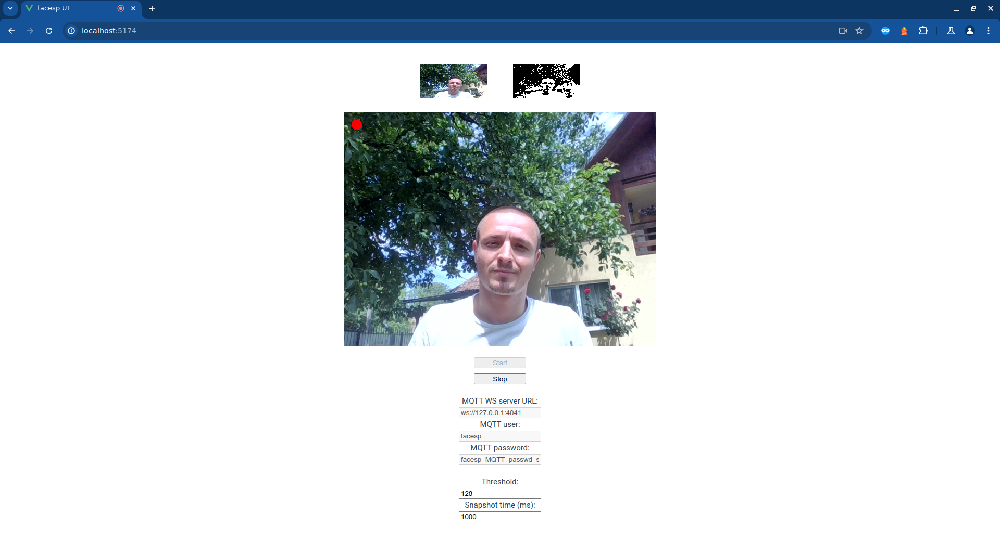
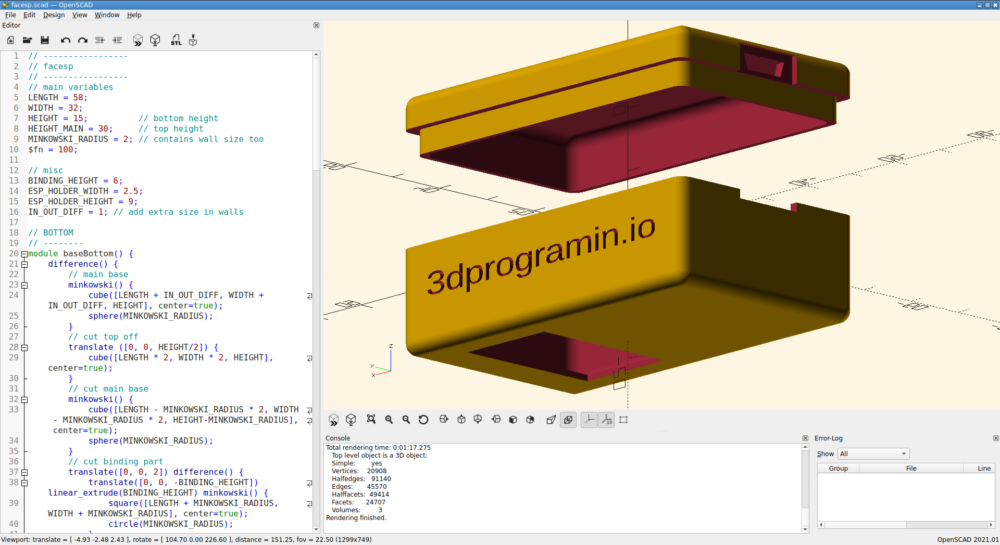

# facesp

FaceSP is an IoT project designed to capture webcam frames through a browser and send them to an MQTT server. The MQTT broker forwards the frames wirelessly to an ESP32 device, which displays them on an OLED screen in black and white. This project involves multiple components, including Arduino code, a Vue3-based UI, and a 3D printable case design.
## Table of Contents
- [Project Structure](#project-structure)
- [Getting Started](#getting-started)
  - [Prerequisites](#prerequisites)
  - [Installation](#installation)
- [Arduino](#arduino)
- [MQTT Server](#mqtt-server)
- [UI](#ui)
- [3D Design](#3d-design-optiona)
- [Usage](#usage)
- [License](#license)

## Project Structure

The project is organized into the following folders:

- **arduino**: Contains the Arduino code and wiring schematics for the ESP32.
  - `facesp.ino`: The Arduino code for the ESP32.
- **server**: Contains the configuration and scripts for setting up the MQTT server.
  - `mosquitto.conf`: Configuration file for the Mosquitto MQTT server.
  - `passwd`: Contains the username and password for the MQTT server.
  - `run.sh`: Bash script to run the Mosquitto server with the specified configuration and password files.
- **ui**: Source code for the user interface, written in Vue3.
- **design**: 3D design files for the ESP32 and OLED case.
  - `facesp.scad`: OpenSCAD design file for the case.
  - `top.stl`: STL file for the top part of the case.
  - `bottom.stl`: STL file for the bottom part of the case.

## Getting Started

### Prerequisites

Before you begin, ensure you have the following software and hardware:

- Arduino IDE
- Node.js and npm
- Mosquitto MQTT server
- ESP32 development board
- OLED display (128x64 pixels)
- Webcam
- 3D printer (optional, for printing the case)

### Installation

Clone the repository to your local machine:

```bash
git clone https://github.com/yourusername/facesp.git
cd facesp
```
## Arduino

1. Open the `facesp.ino` file in the Arduino IDE.
2. Replace the placeholder values for WiFi and MQTT with your actual network credentials:

    ```cpp
    // WIFI
    const char WIFI_SSID[] = "YOUR_WIFI_SSID";
    const char WIFI_PASS[] = "YOUR_WIFI_PASSWORD";

    // MQTT
    const char MQTT_HOST[] = "YOUR_MQTT_HOST";
    const int MQTT_PORT = 4040;   // YOUR MQTT PORT, CHANGE IF NEEDED
    const char MQTT_USER[] = "facesp";
    const char MQTT_PASSWORD[] = "facesp_MQTT_passwd_should_be_replaced!";
    ```

3. Connect your ESP32 to your computer.
4. Select the appropriate board and port in the Arduino IDE (check `images/programmer.png`)
5. Upload the code to the ESP32.
6. Follow the wiring diagram in `images/schematics.png` to connect the OLED display to the ESP32.
## MQTT Server

1. Navigate to the `server` directory:

    ```bash
    cd server
    ```

2. Install Mosquitto MQTT server if you haven't already.

3. Update the `passwd` file with your desired username and password. The default credentials are:

    ```plaintext
    facesp:facesp_MQTT_passwd_should_be_replaced!
    ```

    It is highly recommended to change these credentials for security purposes.

4. Run the Mosquitto server using the provided configuration and password files:

    ```bash
    chmod +x run.sh
    ./run.sh
    ```

## UI

1. Navigate to the `ui` directory:

    ```bash
    cd ui
    ```

2. Install the necessary dependencies:

    ```bash
    npm install
    ```

3. Start the UI:

    ```bash
    npm run serve
    ```

5. Open your web browser and navigate to `http://localhost:8080` to access the UI.
6. Change `MQTT WS server URL` if needed, as well as the username and password
7. Press `Start`
## 3D Design (optional)

The `design` folder contains files for creating a custom case for the ESP32 and OLED display.

1. Use a slicer software to prepare the `top.stl` and `bottom.stl` files for 3D printing.
2. Print the case using a 3D printer.
3. Assemble the ESP32 and OLED display into the printed case.

## Usage

1. Launch the UI from your web browser and press **Start**.
2. Power the ESP32 device.
3. The webcam is now streamed to the device display.

## Screenshots and Images

Below are some images and screenshots to help you visualize the project components and setup:

### Device Photo





<p style="text-align: center;">(on / off button has been taken out in the last version of the case)</p>	

### User Interface



### 3D Design




## License

This project is licensed under the MIT License. See the [LICENSE](LICENSE.md) file for details.